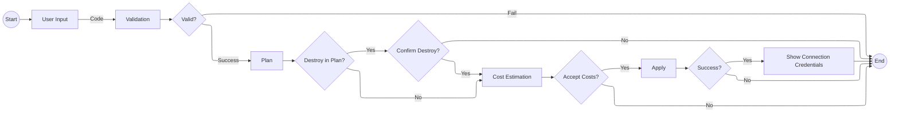

# Infrastructure Change Flow

The basic steps:

1. **Start**: Begin workflow
2. **User Input**: Make changes to the code
3. **Validation**: Check if code is valid
   - If validation fails, workflow ends
   - If validation succeeds, continue to plan
4. **Plan**: Preview what will change
5. **Check Plan for Destroy**:
   - If no destroy operations found in plan, proceed to cost estimation
   - If destroy operations found in plan, require confirmation
6. **Confirm Destroy** (if needed):
   - If destroy confirmed, proceed to cost estimation
   - If destroy rejected, workflow ends
7. **Cost Estimation**: Calculate costs of planned changes
8. **Review Costs**:
   - If costs are acceptable, proceed to apply
   - If costs are not acceptable, workflow ends
9. **Apply**: Make the changes happen
10. **Check Apply Result**:
    - If apply fails, workflow ends
    - If apply succeeds, show connection credentials
11. **Show Connection Credentials**:
    - Display access information for the created resources
12. **End**: Workflow complete