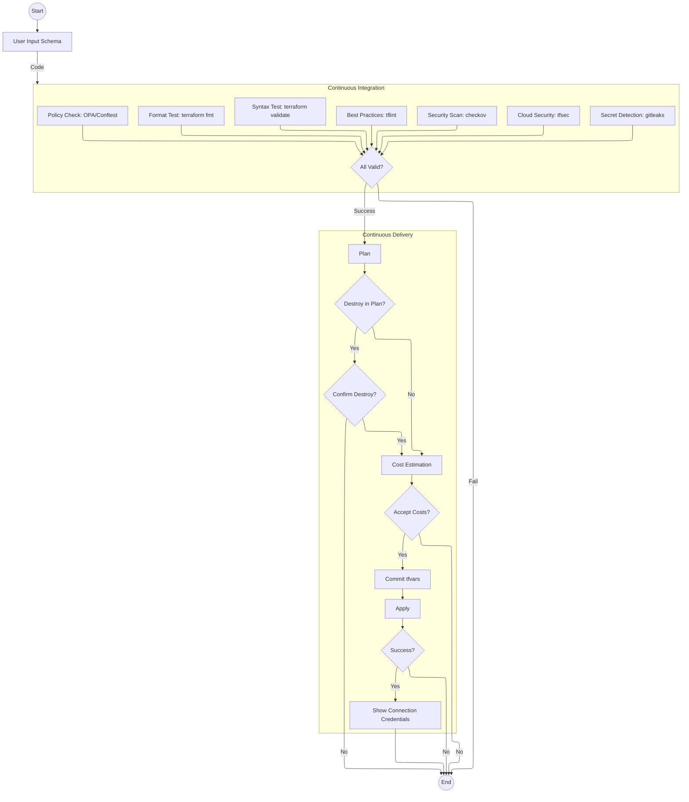

# Infrastructure Change Flow

The basic steps:

1. **Start**: Begin workflow
2. **User Input Schema**: Define infrastructure changes using structured schema
3. **Continuous Integration**:
   - Format Test: Ensure consistent code style and formatting
   - Syntax Test: Validate HCL configuration structure
   - Best Practices: Check for Terraform best practices and patterns
   - Security Scan: Detect security vulnerabilities and misconfigurations
   - Cloud Security: Identify cloud-specific security risks
   - Secret Detection: Find exposed secrets and credentials
   - Policy Check: Enforce organizational policies and compliance
   - All checks must pass to proceed
   - If any check fails, workflow ends
   - If all checks pass, continue to delivery phase
4. **Continuous Delivery**:
   - Plan: Preview what will change
   - Check for destroy operations
   - Estimate and review costs
   - Commit approved changes as tfvars
   - Apply changes
   - Verify success
   - Show access credentials
5. **End**: Workflow complete