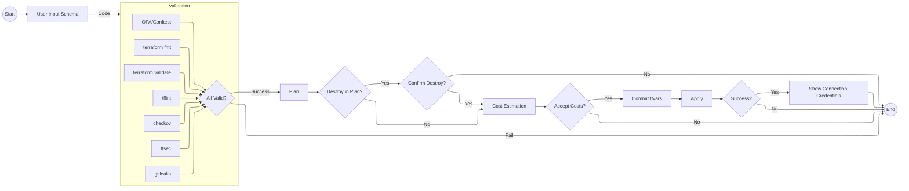

# Infrastructure Change Flow

The basic steps:

1. **Start**: Begin workflow
2. **User Input Schema**: Define infrastructure changes using structured schema
3. **Validation** (parallel CI checks):
   - terraform fmt: Check and enforce consistent code formatting
   - terraform validate: Check configuration syntax and consistency
   - tflint: Detect possible errors and enforce best practices
   - checkov: Scan for security and compliance issues
   - tfsec: Security-focused static analysis
   - gitleaks: Scan for hardcoded secrets and sensitive data
   - OPA/Conftest: Enforce custom organizational policies
   - All checks must pass to proceed
   - If any check fails, workflow ends
   - If all checks pass, continue to plan
4. **Plan**: Preview what will change
5. **Check Plan for Destroy**:
   - If no destroy operations found in plan, proceed to cost estimation
   - If destroy operations found in plan, require confirmation
6. **Confirm Destroy** (if needed):
   - If destroy confirmed, proceed to cost estimation
   - If destroy rejected, workflow ends
7. **Cost Estimation**: Calculate costs of planned changes
8. **Review Costs**:
   - If costs are acceptable, proceed to commit
   - If costs are not acceptable, workflow ends
9. **Commit tfvars**:
   - Save approved input as terraform variables file
   - Commit to code repository for version control
10. **Apply**: Make the changes happen
11. **Check Apply Result**:
    - If apply fails, workflow ends
    - If apply succeeds, show connection credentials
12. **Show Connection Credentials**:
    - Display access information for the created resources
13. **End**: Workflow complete